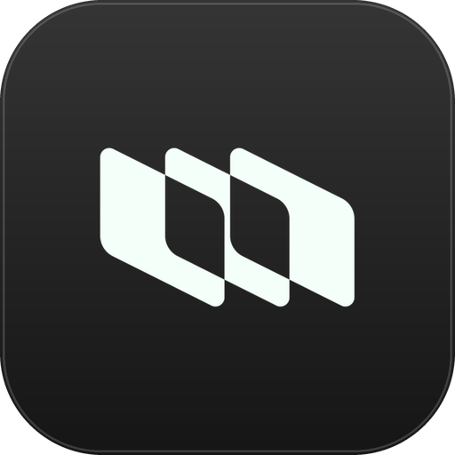

<div align="center">




 <h1>Plane Tasks</h1>

A [Droppy](https://getdroppy.app) droplet that keeps your [Plane](https://plane.so) work items on the shelf.

<p>
  
  
  <a href="LICENSE"></a>
</p>

[Features](#features) · [Install](#install) · [Set up](#set-up) · [Security](#security) · [Changelog](CHANGELOG.md)

</div>

<br>

<div align="center">


</div>

---

### Features

- **Assigned work items** from every project you can access in your workspace, newest first.
- **Pinned tab** for the tasks you want to keep in view, regardless of project or status.
- **Filters and search** with status chips and counts, a project menu, and search by title, ID or project.
- **Task details** with state, priority, dates and project, plus the description rendered with its formatting: headings, lists, checklists, tables, code and links.
- **New task alerts** beside the notch.
- **Compact widget** that shows your pinned tasks.
- **Open in Plane** from any task.

### Requirements

- macOS 15 or later
- Droppy 15.3 or later, or [Droppy Playground](https://getdroppy.app/download/playground)
- A Plane account and a ``Personal Access Token``

### Install

```bash
git clone https://github.com/malumsz/plane-droplet.git
cd plane-droplet
droppykit build      # writes .build/PlaneTasks.droplet
```

This needs the [DroppyKit command line tool](https://getdroppy.app/docs/droppykit).

Droppy runs an unsigned droplet once you approve the build under **Settings → Store → Local droplets**. Droppy Playground loads unsigned droplets without asking.

### Set up

1. In Plane, open **Profile settings → Personal Access Tokens** and create a token.
2. In Droppy, open this droplet's settings and fill in:

   | Field | Value |
   | --- | --- |
   | Workspace slug | The slug from `https://app.plane.so/<workspace-slug>/` |
   | Personal access token | The token you created |
   | Plane API URL | Only for self-hosted Plane. Plane Cloud uses `https://api.plane.so` |

3. Press **Refresh**.

### Security

- The token is stored in the macOS Keychain.
- The droplet only talks to the API URL you configure. It must use `https`.
- The workspace slug may only contain letters, numbers, `-` and `_`.
- Workspace slug, API URL, pinned tasks and notification settings live in Droppy's isolated preferences for this droplet.

### License

[MIT](LICENSE) © [malumsz](https://github.com/malumsz)

---
